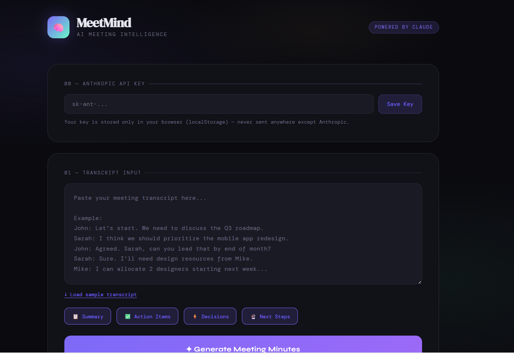

# 🧠 MeetMind — AI Meeting Minutes Generator

> Transform messy meeting transcripts into structured, actionable insights in seconds — powered by Claude AI.

(Screenshot1.png)

---


## ✨ What it does

Paste any meeting transcript and MeetMind instantly extracts:

- 📋 **Executive Summary** — concise 2-3 sentence overview
- ✅ **Action Items** — tasks with assignees and deadlines
- ⚡ **Key Decisions** — what was agreed upon
- 🔮 **Next Steps** — what happens after the meeting

No more spending 15–20 minutes writing meeting notes manually.

---

## 🛠️ Tech Stack

| Layer | Technology |
|-------|-----------|
| Frontend | HTML5, CSS3, Vanilla JavaScript |
| AI Engine | Claude API (claude-sonnet) |
| Styling | Custom CSS with CSS Variables |
| Fonts | Google Fonts (DM Serif Display, DM Mono, Syne) |

---

## 🚀 Try it Live

**[https://juhainaalbadi.github.io/meetmind/](https://juhainaalbadi.github.io/meetmind/)**

No installation needed — just open the link, enter your API key, and go.

---

## 🔑 Getting an API Key

1. Sign up at [console.anthropic.com](https://console.anthropic.com)
2. Go to **API Keys** and create a new key
3. Paste it into the app's **API Key** field — it's saved to your browser only, never sent anywhere except Anthropic

---

## 🛠️ Run Locally

### 1. Clone the repo
```bash
git clone https://github.com/JuhainaAlbadi/meetmind.git
cd meetmind
```

### 2. Open in browser
Open `index.html` — no build tools or dependencies needed. Enter your API key in the app when prompted.

---

## 📸 Demo

Try it with the built-in sample transcript by clicking **"Load sample transcript"**, then hit **Generate Meeting Minutes**.

---

## 🧩 How it works

```
User pastes transcript
        ↓
Transcript sent to Claude API with structured prompt
        ↓
Claude returns JSON with summary, actions, decisions, next steps
        ↓
UI renders results in an interactive dashboard
```

The prompt engineering is designed to extract **named assignees**, **specific deadlines**, and **concrete decisions** — not vague summaries.

---

## 💡 Use Cases

- **Startups** — keep remote teams aligned after standups
- **Universities** — summarize study group or project meetings
- **Corporates** — automate HR, IT, and PM meeting documentation

---

## 🗺️ Roadmap

- [ ] Export to PDF / Word
- [ ] Support audio file input (Whisper API transcription)
- [ ] Slack / Teams integration
- [ ] Multi-language support (Arabic 🇴🇲)

---

## 👩‍💻 Author

**Juhaina Albadi**
BSc Software Engineering 

[](https://github.com/JuhainaAlbadi)

---
